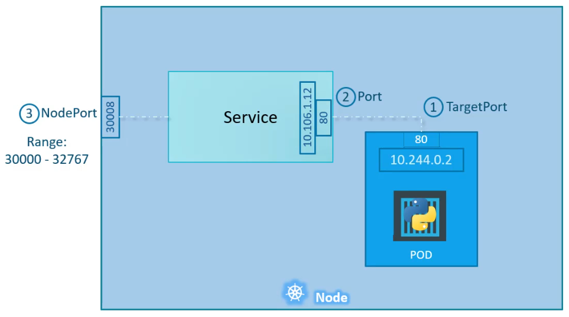
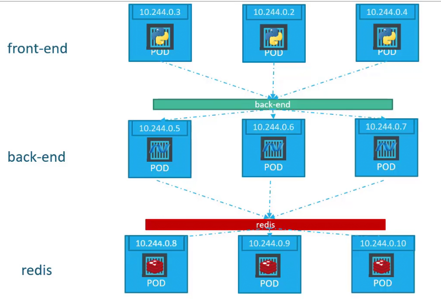
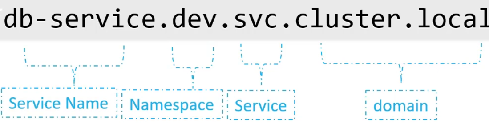

# Core Concepts

## Cluster Architecture

* Kubelet listens for commanda (on each node)
* Kube proxy manages communication between workers (on each node)

### Containers

CRI - lets different solutions for running containers work (containerd etc)

Imagespec - how container images are setup
Runtimespec - how containers run

### ContainerD

For debugging `ctr` official tool

Alt tool: `nerdctl` - more user friendly, similar to `docker` cli

`crictl` works across all CRI runtimes, good for debugging

Very similar to `docker`

### etcd

* KV store
* 2 main APIs (v2, and v3), significant API change
* All k8s changes modify etcd

### Components

* kube-apiserver
  * Who you talk to with `kubectl`
  * Only think that talks to `etcd`
  * either
    * process with settings in systemd service
    * or pod with settings in `/etc/kubernetes/manifests/kube-apiserver.yaml` (kubeadm)
* kube-scheduler
  * Schedules pods on workers, updates etcd
  * decides which pod goes where based on requirements
* kubelet
  * Makes changes on worker
  * does EVERYTHING on node, communicates with api-server
  * Need to run on worker as service
* Controller-Manager (brain of k8s)
  * Manages controllers (processes that monitor status of components, nodes etc)
  * Controllers are inside Controller-Manager process
* kube-proxy
  * Deals with communications
  * Internal IPs can change on nodes, we use services instead of pod IPs
  * kube-proxy runs on each node and creates rules based on services so pod is accessible

### Pods

* We can create pods with `yaml`
* Several keys required in yaml

Required:

```yaml
apiVersion:
kind:
metadata:
spec:
```

Typical pod values:

```yaml
apiVersion: v1
kind: Pod
metadata:
  name: myapp-pod
  labels:
    app: myapp
spec:
    containers:
        - name: nginx-container
          image: nginx
```

```shell
kubectl create -f $FILE.yaml
kubectl describe myapp-pod
```

For viewing state:

```shell
kubectl describe pod webapp
kubectl get pod webapp -o yaml
```

Checking where pod is located:

```shell
kubectl get pods -o wide
```

## ReplicaSets

* A controller
* Lets is run multiple pods for HA
* Enforces number of pods
* Also used for load scaling
* Controller with balance pods across multiple nodes

ReplicaSet replaces depreciated Replication Controller

Depreciated **Replication Controller**:

Create:

```yaml
apiVersion: v1
kind: ReplicationController
metadata:
  name: myapp-rc
  labels:
    app: myapp
    type: front-end
spec:
  template:
    metadata:
    name: myapp-pod
    labels:
        app: myapp
    spec:
      containers:
        - name: nginx-container
          image: nginx
  replicas: 3
```

So spec.template is children

```shell
kubectl create -f $FILE.yml
kubectl get replicationcontroller
```

**ReplicaSet:**

selector is main difference, its required and takes children labels

Create:

```yaml
apiVersion: apps/v1
kind: ReplicaSet
metadata:
  name: myapp-replicaset
  labels:
    app: myapp
    type: front-end
spec:
  template:
    metadata:
    name: myapp-pod
    labels:
        app: myapp
    spec:
      containers:
        - name: nginx-container
          image: nginx
  replicas: 3
  selector:
    matchLabels:
      type: front-end
```

```shell
kubectl create -f $FILE.yml
kubectl get replicaset
```

ReplicaSet monitors and keeps pods up based on labels and selectors.

## Scaling

Several options for scaling.

```shell
kubectl replace -f $FILE.yml # With updated replicas
kubectl scale --replicas=6 -f $DEFINITION.yml
kubectl scale --replicas=6 replicaset myapp-replicaset # By name
```

## Deployments

Used for rolling updates and scaling.

Deployments are a superset of other objects like ReplicaSet

Compared to ReplicaSet only `kind: Deployment` needs changing:

```yaml
apiVersion: apps/v1
kind: Deployment
metadata:
  name: myapp-replicaset
  labels:
    app: myapp
    type: front-end
spec:
  template:
    metadata:
    name: myapp-pod
    labels:
        app: myapp
    spec:
      containers:
        - name: nginx-container
          image: nginx
  replicas: 3
  selector:
    matchLabels:
      type: front-end
```

```shell
kubectl create -f $FILE.yml
kubectl get deployments
kubectl get all # show all (pods, replicasets, deployments)
```

## Creating YAML in CKA

Using the `kubectl run` command can help in generating a YAML template. And sometimes, you can even get away with just the `kubectl run` command without having to create a YAML file at all. For example, if you were asked to create a pod or deployment with a specific name and image, you can simply run the `kubectl run` command.

* [Conventions](https://kubernetes.io/docs/reference/kubectl/conventions/)

Create an NGINX Pod

```shell
kubectl run nginx --image=nginx
```

Generate POD Manifest YAML file (`-o yaml`). Don’t create it(–dry-run)

```shell
kubectl run nginx --image=nginx --dry-run=client -o yaml
```

Create a deployment

```shell
kubectl create deployment --image=nginx nginx
```

Generate Deployment YAML file (`-o yaml`). Don’t create it(`--dry-run`)

```shell
kubectl create deployment --image=nginx nginx --dry-run=client -o yaml
```

Generate Deployment YAML file (`-o yaml`). Don’t create it (`--dry-run`) and save it to a file.

```shell
kubectl create deployment --image=nginx nginx --dry-run=client -o yaml > nginx-deployment.yaml
```

Make necessary changes to the file (for example, adding more replicas) and then create the deployment.

```shell
kubectl create -f nginx-deployment.yaml
```

OR

In k8s version 1.19+, we can specify the –replicas option to create a deployment with 4 replicas.

```shell
kubectl create deployment --image=nginx nginx --replicas=4 --dry-run=client -o yaml > nginx-deployment.yaml
```

## Services

Help with establishing connections.

Pods are on private net, we need to expose services within them

Service is an object that:
* NodePort: forwards ports from node to pod
* ClusterIP: Creates virtual IP for internal communication
* LoadBalance: Distributes traffic

### NodePort

* TargetPort: pod port
* Port: port for Service to Pod
* NodePort: port on Node



```yaml
apiVersion: v1
kind: Service
metadata:
  name: myapp-service
spec:
  type: NodePort
  ports:
    - targetPort: 80  # Required
      port: 80        # If unset will be same as port
      nodePort: 30008 # If unset will be random 30000-32767
  selector: # Matching Pod labels
    app: myapp
    type: front-end
```

```shell
kubectl create -f $FILE.yml
kubectl create service nodeport redis-service --dry-run=client --tcp=6379:6379 -o yaml
kubectl get services
curl https://$NODE_IP:30008
```

For multiple Pods the service matches all matching labels and load balances

When Pods are on different nodes the service spans them all, and you can use any node IP.

### ClusterIP

When many clusters of Pods need to talk between various services we use ClusterIP:



```yaml
apiVersion: v1
kind: Service
metadata:
  name: back-end
spec:
  type: ClusterIP
  ports:
    - targetPort: 80  # Port where backend exposed
      port: 80        # Port where service exposed
  selector: # Matching Pod labels
    app: myapp
    type: back-end
```

```shell
kubectl create -f $FILE.yml
kubectl create service clusterip redis-service --dry-run=client --tcp=6379:6379 -o yaml
kubectl get services
```

## LoadBalancer

Lets us use ONE ip for app.

Uses native cloud provider LB. If unsupported reverts to NodePort. Same config as NodePort.


```yaml
apiVersion: v1
kind: Service
metadata:
  name: myapp-service
spec:
  type: LoadBalancer
  ports:
    - targetPort: 80  # Required
      port: 80        # If unset will be same as port
      nodePort: 30008 # If unset will be random 30000-32767
  selector: # Matching Pod labels
    app: myapp
    type: front-end
```

## Namespaces

Allows grouping resources.

Default namespace is `default`.
kubernetes shas a few for the system:

* kube-system
* kube-public

Can set quotas per namespace.

If you are connecting to external namespaces outside of your own you need to append the namespace:

EG: For `db-service` in `dev` namespace:

* `db-service.dev.svc.cluster.local`

This DNS entry is added by default.



```shell
kubectl get pods --namespace=$NAMESPACE
kubectl create -f --namespace=$NAMESPACE
```

Can put namespace in `metadata`

```yaml
apiVersion: v1
kind: Pod
metadata:
  namespace: dev
  name: myapp-pod
  labels:
    app: myapp
spec:
    containers:
        - name: nginx-container
          image: nginx
```

To create a Namespace:

```shell
kubectl create namespace $NAMESPACE
```

or

```yaml
apiVersion: v1
kind: Namespace
metadata:
  name: dev
```

We can switch namespace:

```shell
kubectl config set-context $(kubectl config current-context) --namespace=$NAMESPACE
```

All namespaces:

```shell
kubectl get pods --all-namespaces
```

For quotas:

```yaml
apiVersion: v1
kind: ResourceQuota
metadata:
  namespace: dev
  name: compute-quota
spec:
  hard:
    pods: "10"
    requests.cpu: "4"
    requests.memory: 5Gi
    limits.cpu: "10"
    limits.memory: 10Gi
```

## Imperative vs Declerative

Imperative:

```shell
kubectl run --image=nginx nginx
kubectl create deployment --image=nginx nginx
kubectl expose deployment nginx --port 80
kubectl edit deployment nginx
kubectl edit deployment nginx --replicas=5
kubectl set image deployment nginx nginx=nginx:1.18
kubectl create -f $FILE.yml
kubectl replace -f $FILE.yml
kubectl delete -f $FILE.yml
```

Declerative:

Use kubectl and describe state:

```shell
kubectl apply -f FILE.yml
```

`apply` modifies state to match file.

Declerative is best practice.

For apply:

* Edit original yaml
* `kubectl apply -f $TARGET`
* Can `kubectl apply -f $DIRECTORY`

## Apply

3 States:
* Local file
* Last applied
* Live object

* If object doesnt exist, apply creates
* The initial state is stored
* On next change we compare differences with "last applied"
* Intelligently updates live configuration

Dont mix apply and imperative.


