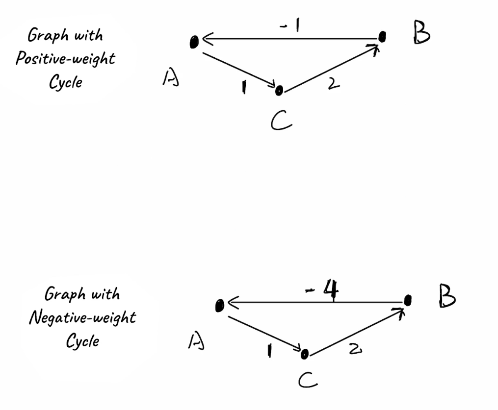
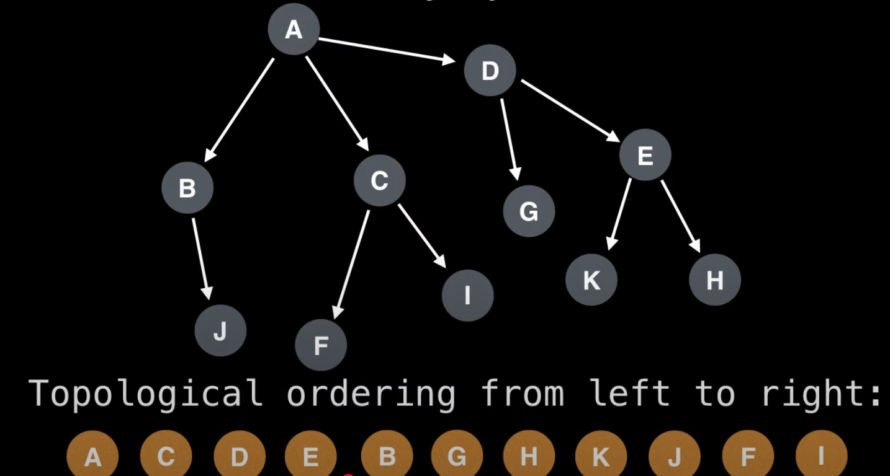

# Graphs

## Shortest Path for Weighted Graph

### Dijkstra’s

`O((V + E) log V)` with a binary heap.

(Only works with pos weights)

[Video](https://youtu.be/EFg3u_E6eHU?si=KAFs7dVMTXp919W3)

Basic idea:

* Determine shortest path from src to dest
* To do this, determine shortest path to EVERY node along the way

Approach:

* Mark every node as distance=inf except src (0)

Main steps after:

* In map, update distances to neighbors (if shorter), mark as visited
* Next, travel to next shortest node away (use prio queue). Mark visited.
* Repeat
Use a visited set and skip in pq if already visited

EG:

```
      [A]
     /   \
   1/     \10
   /       \
 [B] ----1-- [C]
   \       /
   6\     /4
     \   /
      [D]
```

```python
import heapq

def dijkstra(graph, start):
    # graph is in the form: {node: [(neighbor, weight), ...], ...}
    distances = {node: float('inf') for node in graph}
    distances[start] = 0
    visited = set()

    # Priority queue: (distance_from_start, node)
    pq = [(0, start)]

    while pq:
        current_distance, current_node = heapq.heappop(pq)

        # Skip if already visited
        if current_node in visited:
            continue
        visited.add(current_node)

        # Relax edges
        for neighbor, weight in graph[current_node]:
            distance = current_distance + weight
            if distance < distances[neighbor]:
                distances[neighbor] = distance
                heapq.heappush(pq, (distance, neighbor))

    return distances


# Example graph
graph = {
    'A': [('B', 1), ('C', 10)],
    'B': [('C', 1), ('D', 6)],
    'C': [('D', 4)],
    'D': []
}

print(dijkstra(graph, 'A'))
```

### Bellman-Ford Algorithm

Use if we have negative path weights.

DP strategy.

---

Intuition:
Bellman–Ford finds the shortest path from a source node by:

Trying all edges again and again (up to |V|−1 times), and updating a node’s distance whenever we find a cheaper way to get there through another node.

It's like saying:

“If I already know the shortest way to get to A, and there’s an edge from A → B, then maybe I now also know a better way to get to B.”

Because the longest possible simple path in a graph with V nodes has V−1 edges — so if we relax all edges V−1 times, we’re guaranteed to propagate all minimal costs forward.

---

[Bellman Ford](https://youtu.be/FtN3BYH2Zes?si=ady6gKsfmVi5RB88)

`O(V * E)`

Theorem 1: In a "graph with no negative-weight cycles? with N vertices, the shortest path between any two vertices has at most N-1 edges.

A negative weight cycle is one that results in a negative path after the cycle is completed.

For example, a positive weight cycle could be

```
A - 1 -> C - 2 -> B - -1 -> A
```




The cost from A to B is +2, going back to A we subtract one resulting in a weight greater than zero (2).

The reason the shortest path has at most N-1 edges is that because there are no negative weight cycles, starting over from the original cycle we'll just increase the cost or make it the same.

So, basic idea - "relax" edges N-1 times (N is num vertices).

Relaxation refers to trying a connection and seeing if it reduces the cost to get to that vertex. If it does we reduce it accordingly and that is relaxation

Initially mark the cost to get to a vertex as Infinity for all vertex
Loop over all edges in any order.

For an edge between vertex u and v.

```
if dist[u] + cost(u,v) < dist[v]:
    dist[v] = dist[u] + cost(u,v)
```

Full example:

```python
def bellman_ford(n, edges, source):
    INF = float('inf')
    dist = [INF] * n
    dist[source] = 0

    # Relax all edges (V - 1) times
    for _ in range(n - 1):
        for u, v, w in edges:
            if dist[u] != INF and dist[u] + w < dist[v]:
                dist[v] = dist[u] + w

    # Optional: Detect negative-weight cycle
    for u, v, w in edges:
        if dist[u] != INF and dist[u] + w < dist[v]:
            raise ValueError("Graph contains a negative-weight cycle")

    return dist

# Graph:
# A → B (4)
# A → C (2)
# C → B (1)
# B → D (2)
# C → D (5)

# Convert node names to indices: A=0, B=1, C=2, D=3
edges = [
    (0, 1, 4),  # A → B
    (0, 2, 2),  # A → C
    (2, 1, 1),  # C → B
    (1, 3, 2),  # B → D
    (2, 3, 5),  # C → D
]

n = 4
source = 0  # A

distances = bellman_ford(n, edges, source)

print("Shortest distances from A:")
print(f"A: {distances[0]}")
print(f"B: {distances[1]}")
print(f"C: {distances[2]}")
print(f"D: {distances[3]}")
```

Note:

We can limit the maximum number of edges traversed to see the shortest path with an additional restriction of how many edges we can traverse. For example if we wanted to traverse a maximum of K edges we would use that instead of N-1

If we do this we must use a temp variable! This is because otherwise we update additional times in the cycle:

```python
def bellman_ford(n, edges, source):
    INF = float('inf')
    dist = [INF] * n
    dist[source] = 0

    # Relax all edges (V - 1) times
    for _ in range(n - 1):
        curr = dist[:]
        for u, v, w in edges:
            # dist holds the best distances found using ≤ i edges.
            # curr should hold the best distances using ≤ i+1 edges.
            if dist[u] != INF and dist[u] + w < curr[v]:  # Keep start location same (old), use new curr
                curr[v] = dist[u] + w
        dist = curr

    # Optional: Detect negative-weight cycle
    for u, v, w in edges:
        if dist[u] != INF and dist[u] + w < dist[v]:
            raise ValueError("Graph contains a negative-weight cycle")

    return dist
```

## Topological Sort

[Video (Kahn's)](https://www.youtube.com/watch?v=cIBFEhD77b4)

[Leetcode Explore Card Kahn's Algorithm](https://leetcode.com/explore/learn/card/graph/623/kahns-algorithm-for-topological-sorting/3886/)

Lets us model dependencies with a graph.

`O(V+E)`

Gives us an order we can traverse to path through graph from most dependant to least.



There can be multiple orderings.

### Kahn's Algorithm

In-degree for node represents how many must come before

If a node’s in-degree is 0, it means no prerequisites

Repeatedly remove nodes without dependencies from the graph and add them to the topological ordering.

As we remove them from the graph, we removed their outgoing edges, and new nodes without dependencies become free.

We repeat the process until we have looked at every node or we have found a cycle

Use a queue to maintain zero dependencies nodes.

[Example](https://leetcode.com/problems/course-schedule/description/)

```python
from collections import defaultdict, deque
class Solution:
    def canFinish(self, numCourses: int, prerequisites: List[List[int]]) -> bool:
        if not prerequisites:
            return True

        adj = defaultdict(list)
        in_deg = defaultdict(int)
        # Create adjacency list and in degree map
        for parent, child in prerequisites:
            adj[child].append(parent)
            in_deg[parent] += 1
            if parent not in in_deg:
                in_deg[parent] = 0

        # Account for ALL courses, even if not in prereq

        for v in range(0, numCourses):
            if v not in in_deg:
                in_deg[v] = 0

        # Create queue for zero degree items
        q = deque()
        for k, v in in_deg.items():
            if v == 0:
                q.append(k)

        # ordering
        order = []

        # iterate over queue while it has items
        while q:
            node = q.popleft()
            order.append(node)

            for nei in adj[node]:
                in_deg[nei] -= 1
                if in_deg[nei] == 0:
                    q.append(nei)


        # cycle detected
        if len(order) != numCourses:
            return False

        return True
```

Or, a more conventional example:

```python
from collections import deque, defaultdict
from typing import Dict, Iterable, List, Tuple, Hashable

def kahn_toposort(edges: Iterable[Tuple[Hashable, Hashable]]) -> List[Hashable]:
    """
    Perform topological sort using Kahn's algorithm.
    edges: iterable of (u, v) meaning a directed edge u -> v

    Returns a list of nodes in topological order.
    Raises ValueError if a cycle is detected.
    """
    # Build adjacency list and indegree counts
    adj: Dict[Hashable, List[Hashable]] = defaultdict(list)
    indeg: Dict[Hashable, int] = defaultdict(int)
    nodes = set()

    for u, v in edges:
        adj[u].append(v)
        indeg[v] += 1
        nodes.add(u); nodes.add(v)

    # Include isolated nodes (if you have an external node list, merge it into 'nodes')
    for u in list(nodes):
        indeg.setdefault(u, 0)

    # Queue of all nodes with no incoming edges
    q = deque([n for n in nodes if indeg[n] == 0])

    order: List[Hashable] = []
    while q:
        u = q.popleft()
        order.append(u)
        for v in adj[u]:
            indeg[v] -= 1
            if indeg[v] == 0:
                q.append(v)

    if len(order) != len(nodes):
        # Some nodes were never removed ⇒ cycle exists
        raise ValueError("Graph has at least one cycle; topological order does not exist.")

    return order

# --- Example usage ---

# DAG example:
# A → C → D
#  ↘︎ B → ↗︎
edges = [
    ("A", "C"),
    ("A", "B"),
    ("B", "D"),
    ("C", "D"),
]

order = kahn_toposort(edges)
print("Topological order (DAG):", order)
# Possible output (one of many valid orders):
# Topological order (DAG): ['A', 'B', 'C', 'D']  or  ['A', 'C', 'B', 'D']

# Cycle example: 1 → 2 → 3 → 1
cyclic_edges = [(1, 2), (2, 3), (3, 1)]
try:
    kahn_toposort(cyclic_edges)
except ValueError as e:
    print("Cycle example:", e)
# Output:
# Cycle example: Graph has at least one cycle; topological order does not exist.
```
